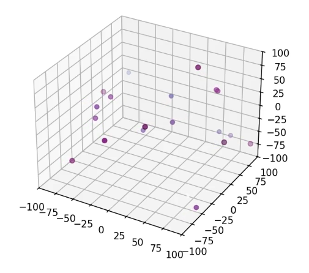

class: center, middle, gray-background

# Research software engineering for HPC

## Samantha Wittke 

### CSC - IT Center for Science


&nbsp;

Text: CC-BY 4.0
(Big thanks to previous versions by Radovan Bast and the CodeRefinery team)

Link to these slides: TODO

---

# Part 1 - 15 min

- About us
- Why are we talking about this?
- CodeRefinery
- Topic overview
- Example project

---


# About us

.left-column50[
Johan you already know :)
]

.right-column50[

Samantha: 

- Geoecology and Geoinformatics background.

- Researcher who writes code

- Training, outreach and collaboration coordination.

- 2025 fellow of the Software Sustainability institute - community building around research software in Nordics. 

- Leading the
  [CodeRefinery project and community](https://coderefinery.org).
]

---

# What is Research Software Engineering?

Here it is about all the essential tools which are usually skipped in academic education so everyone can make full use of software, computing, and data with focus on **reusability, reproducibility, and openness**.

-> Everything **around programming**, that helps you be more efficient in your work and supports the reusability of your code. 

---

# Why are we talking about Research Software Engineering?

- RSE is part of computational research, but not often taught.
- "You don't know what you don't know"
- Working alone, working with others, sharing your work
- Hands-on experience

---


class: center, middle, inverse

# You don't need to be a

# "proper software engineer/developer"

# to produce research software

We consider **any code, script, notebook, or file, regardless of size**, as
"research software" if it is needed to generate, visualize, or reproduce
data/results as part of a publication.

---

# CodeRefinery

**Typical format**: 3 half-days + 6 topical sessions, lessons + exercises [twice per
year](https://coderefinery.org/workshops/upcoming/), online, free,
live-streamed, recorded, archived asynchronous Q&A in collaborative document
.left-column50[
- Version control
- Collaboration using Git
- Testing
- Documentation
- Notebooks
- Modular code development
- Reproducible research
- Software licensing
- How to share and publish code
- How to organize a code project
- **...**
]

.right-column50[
**Next workshop** September 9-11 and 6 following Wednesdays, register here: <https://coderefinery.github.io/2025-09-09-workshop/>

**Lesson materials:** https://coderefinery.org/lessons/
]

---

# [Topics of today](https://coderefinery.github.io/research-software-engineering/)

Lectures and exercises:

- [Version control](https://coderefinery.github.io/research-software-engineering/ xxx /)

- [Documentation](https://coderefinery.github.io/research-software-engineering/ xxx /)

- [Reproducibility](https://coderefinery.github.io/research-software-engineering/ xxx /)

- [Sharing and reusing](https://coderefinery.github.io/research-software-engineering/sharing-reusing/)

Longer version of all topics including more exercises can be found in [CodeRefinery lesson materials](https://coderefinery.org/lessons).

---


# Example project: simulating the motion of a number of planets



- N-body simulation 
- Written in Python. 
- No need to understand the code in any detail.

Link to example project: <https://github.com/coderefinery/planets>

---

# Part 2 - 20 min

- Find more info
- Motivation
- Commits
- Branching
- Talking about code
- Reproducibility
- Collaboration
- Code Review

---

class: middle, inverse

# Version control

# &#128220;

Inspiration and where to find more:
- [Introduction to version control with Git](https://coderefinery.github.io/git-intro/)
- [Collaborative distributed version control](https://coderefinery.github.io/git-collaborative/)
- [Collaborating and sharing using GitHub without command line](https://coderefinery.github.io/github-without-command-line/)

---

## Motivation: Version control is an answer to these questions:

.quote["It broke ... hopefully I have a working version somewhere?"]

.quote["Can you please send me the latest version?"]

.quote["Where is the latest version?"]

.quote["Which version are you using?"]

.quote["Which version have the authors used in the paper I am trying to reproduce?"]

.quote["Found a bug! Since when was it there?"]

.quote["I am sure it used to work. When did it change?"]

---

## Commits: keeping track of changes ([example repository](https://github.com/coderefinery/git-intro/commits/main/))

.left-column40[

]

.right-column60[

]

---

## Features: roll-back, branching, merging, collaboration

- .emph[Roll-back]: you can always go back to a previous version and compare

- .emph[Branching and merging]: work on different ideas at the same time

- .emph[Collaboration]: review, compare, share, discuss


What if two people, at the same time, make two different changes?  Git
can support merging them together.  Image created using <https://gopherize.me/>
([inspiration](https://twitter.com/jay_gee/status/703360688618536960)).


---

## Reproducibility ([browse this example online](https://github.com/networkx/networkx/blame/main/networkx/algorithms/boundary.py))


---


## Talking about code

.quote[Clone the code, go to the file "src/util.rs", and search for "time_iso8601". Oh! But make sure you use the version from August 2023.]


### Or I can send you a [permalink](https://github.com/NordicHPC/sonar/blob/75daafc86582feb06299d6a47c82112f39888152/src/util.rs#L40-L44)


.cite[https://github.com/NordicHPC/sonar/blob/75daafc86582feb06299d6a47c82112f39888152/src/util.rs#L40-L44]

---

## Collaboration through branches or forks


---

## Code review


<br>

- Changes are reviewed before they are merged

- Main motivation for code review is the .emph[collaborative learning]

- Also: better code quality

---

## Demonstration

<https://github.com/coderefinery/planets>

<br>
<br>


- Commits = snapshots with author, date, message, and ID
- Branches = parallel universes for safe experimentation
- Annotate code to track changes line by line
- Collaboration: fork, clone, review, share, discuss
- Code review via pull or merge requests

---

## Note: Git can support more than code!

<br>
<br>

- Software (this is how it started but Git/GitHub can track a lot more)
- Scripts
- Documents (plain text files much better suitable than Word documents, this material and slides are tracked using Git)
- Manuscripts (Git is great for collaborating/sharing LaTeX or [Quarto](https://quarto.org/) manuscripts)
- Configuration files
- Website sources : [Source for CodeRefinery website](https://github.com/coderefinery/coderefinery.org/)
- Data (see also [git-annex](https://scicomp.aalto.fi/scicomp/git-annex/), [git LFS](https://git-lfs.com/))

---

class: middle, inverse

Exercises I - 20 min

TODO:link

---

Part 3 - 20 min

- Reproducibility
- directory structure
- recording dependencies
- recording computational steps

---

class: middle, inverse

# Reproducibility

# &#128230;

Inspiration and where to find more:
- [CodeRefinery reproducible research lesson ](https://coderefinery.github.io/reproducible-research/)
- [The Turing Way: Guide for Reproducible Research](https://the-turing-way.netlify.app/reproducible-research/reproducible-research.html)
- [Ten simple rules for writing Dockerfiles for reproducible data science](https://doi.org/10.1371/journal.pcbi.1008316)
- [Computing environment reproducibility](https://doi.org/10.5281/zenodo.8089471)

---


.cite[Heidi Seibold, CC-BY 4.0, https://twitter.com/HeidiBaya/status/1579385587865649153]

---


# It all starts with a good directory structure ...

```
project_name/
├── README.md             # overview of the project
├── data/                 # data files used in the project
│   ├── README.md         # describes where data came from
│   └── sub-folder/       # may contain subdirectories
├── processed_data/       # intermediate files from the analysis
├── manuscript/           # manuscript describing the results
├── results/              # results of the analysis (data, tables, figures)
├── src/                  # contains all code in the project
│   ├── LICENSE           # license for your code
│   ├── requirements.txt  # software requirements and dependencies
│   └── ...
└── doc/                  # documentation for your project
    ├── index.rst
    └── ...
```

.quote[Lottery factor: If you win the lottery and leave research today, will others be able to continue your work?]

---

class: middle, center, inverse

# "it works on my machine &#129335;"

---

## Recording dependencies


**Conda, Anaconda, pip, virtualenv, Pipenv, pyenv, Poetry, rye, requirements.txt,
environment.yml, renv**, ...
- Define dependencies
- .emph[Communicate dependencies]
- Install these dependencies
- Record the versions
- Isolate environments
- Provide tools and services to share packages

Isolated environments help you make sure
that you .emph[know your dependencies]!

---

## Dependencies - kitchen analogy


.cite[Midjourney, CC-BY-NC 4.0]

<br>

- Software <-> recipe

- Data <-> ingredients

- Libraries <-> cooking books/blogs

---

.left-column50[


.cite[From [reddit](https://www.reddit.com/r/ProgrammerHumor/comments/cw58z7/it_works_on_my_machine/)]
]

.right-column50[
## Containers- kitchen analogy
- Our codes/scripts <-> cooking recipes

- Container definition files <-> like a blueprint to build a kitchen with all
  utensils in which the recipe can be prepared.

- Container images <-> example kitchens

- Containers <-> identical factory-built mobile food truck kitchens
]

---

## Recording computational steps

<br>

.left-column60[
Apart from the environment we also need a way to record and .emph[communicate] computational steps:

- **README** (steps written out "in words")

- **Scripts** (typically shell scripts)

- **Notebooks** (Jupyter or R Markdown)

- **Workflows** (Snakemake, doit, ...)
]

.right-column40[


.cite[Midjourney, CC-BY-NC 4.0]
]

---

class: middle, inverse

# Break - 20 min

---

Part 4 - 20 min

Documentation
- Where to find more
- Why?
- Checklist
- Comments
- in code
- README
- Growing out of readme

---

class: middle, inverse

# Documentation

# &#128151;&#9993;&#65039; to your future self

Inspiration and where to find more:
- [Documentation - CodeRefinery lesson material](https://coderefinery.github.io/documentation/) by [CodeRefinery](https://coderefinery.org/)
- [My short talk on "Documenting code"](https://github.com/samumantha/documentation_example)

---

## Why? &#128151;&#9993;&#65039; to your future self

<br>


- .emph[You] will probably use your code in the future and may forget details.

- You may want .emph[others] to use your code (almost impossible without documentation).

- You may want others to contribute to the code.

- Time is limited - let the documentation answer FAQs.

---

## In-code documentation

Not very useful (more commentary than comment):
```python
# now we check if temperature is larger than -50
if temperature > -50:
    print("ERROR: temperature is too low")
```

Keeping zombie code "just in case" (rather use version control):
```python
# do not run this code!
# if temperature > 0:
#     print("It is warm")
```

Emulating version control:
```python
# somebody: threshold changed from 0 to 15 on August 5, 2013
if temperature > 15:
    print("It is warm")
```

---

## In-code documentation

More useful (explaining .emph[why]):
```python
# we regard temperatures below -50 degrees as measurement errors
if temperature > -50:
    print("ERROR: temperature is too low")
```

---

## In-code documentation

.left-column30[
- Useful for those who want/need to understand and modify the code

- Docstrings can be useful both for .emph[developers and users of a function]
]

.right-column60[
```python
def kelvin_to_celsius(temp_k: float) -> float:
    """
    Converts temperature in Kelvin to Celsius.

    Parameters
    ----------
    temp_k : float
        temperature in Kelvin

    Returns
    -------
    temp_c : float
        temperature in Celsius
    """
    assert temp_k >= 0.0, "ERROR: negative T_K"

    temp_c = temp_k - 273.15

    return temp_c


print(kelvin_to_celsius.__doc__)
```
]

---

## README - Checklist

- .emph[Purpose]
- Installation instructions
- Dependencies and their versions or version ranges
- .emph[Copy-paste-able example to get started]
- Tutorials covering key functionality
- Reference documentation (e.g. API) covering all functionality
- How do you want to be asked questions (mailing list or forum or chat or issue tracker)
- Possibly a FAQ section
- Authors
- .emph[Recommended citation]
- License
- Contribution guide

See also[JOSS review checklist](https://joss.readthedocs.io/en/latest/review_checklist.html)

---


## Often a README is enough (first impression!)

.left-column50[
```markdown
# Project title

## Purpose

Motivation (why the project exists)
and basics.

## Installation

How to setup. Dependencies and their
versions.

## Getting started

Copy-pastable quick start example.
Tutorials covering key functionality.

## Usage reference

...

## Recommended citation

...

## License

...
```
]

.right-column50[

]

---

## When projects grow out of a README

- Write documentation in
  [Markdown (.md)](https://en.wikipedia.org/wiki/Markdown)
  or
  [reStructuredText (.rst)](https://en.wikipedia.org/wiki/ReStructuredText)
  or
  [R Markdown (.Rmd)](https://rmarkdown.rstudio.com/)

- In the .emph[same repository] as the code -> version control and **reproducibility**

- Use one of many tools to build HTML out of md/rst/Rmd:
  [Sphinx](sphinx-doc.org),
  [Zola](https://www.getzola.org/), [Jekyll](https://jekyllrb.com/),
  [Hugo](https://gohugo.io/), RStudio, [knitr](https://yihui.org/knitr/),
  [bookdown](https://bookdown.org/),
  [blogdown](https://bookdown.org/yihui/blogdown/), ...

- Deploy the generated HTML to [GitHub Pages](https://pages.github.com/) or
  [GitLab Pages](https://docs.gitlab.com/ee/user/project/pages/)


## Examples

- [All CodeRefinery lessons](https://coderefinery.org/lessons/from-coderefinery/)
- <https://github.com/networkx/networkx>

---

class: middle, inverse

Exercises II - 20 min

TODO:link


---

Part 5 - 10 min

Sharing and reusing

- Where to learn more
- Why it matters
- Beginning and later
- Derivative
- in practice
- citation
- reusing

---

class: middle, inverse

# Sharing and reusing

# &#127803;

Inspiration and where to find more:
- [UiT research software licensing guide (draft)](https://research-software.uit.no/blog/2023-software-licensing-guide/)
- [Social coding lesson material](https://coderefinery.github.io/social-coding/) by [CodeRefinery](https://coderefinery.org/)

---

# Why software licenses matter

- .emph[You find some great code or data] that you want to reuse for your own
  publication (good for the original author: you will cite them and maybe other
  people who cite you will cite them).

- You need to .emph[modify the code] a little bit, or you remix the data a bit.

- When it comes time to publish, you realize there is .emph[no license].


### Now we have a problem:

- You manage to **publish the paper without the software/data** but others cannot
  build on your software and data and
  you don't get as many citations as you could.
- Or, you **cannot publish it at all** if the journal requires that papers should
  come with data and software so that they are reproducible.

---

.left-column50[
### Beginning of a project


.cite[Midjourney, CC-BY-NC 4.0]

<br>

- License does not seem important
- Easy to change (*)
- Work as if the code is public even though it still may be private
- "Open core" approach: Core can
  be open and on a public branch, unpublished code can be on a private
  repository
]

.right-column50[
### Later in the project


.cite[C.Stadler/Bwag, CC-BY-SA 4.0]

<br>

- Can be important
- Especially when combining codes or organizations
- Difficult to change
- Difficult to remove code that should not be published
- Authors change affiliation
]

---

## Is your work .emph[derivative work] or not?

.left-column50[


.cite[European Union Public Licence (EUPL): guidelines July 2021, <https://data.europa.eu/doi/10.2799/77160>]
]

.right-column50[
- .emph[Derivative work]: You have started from an existing code and made changes to
  it or if you incorporated an existing code into your code

- You have started from scratch: .emph[not derivative work]
]

---

## How do I add a license to my work?

- Create a `LICENSE` file or `LICENSES/` folder in your project which will hold
  [license texts](https://reuse.software/faq/#license-templates).
- On top of each file add and adapt
  the following header ([more examples](https://reuse.software/faq/)):
  ```python
  # SPDX-FileCopyrightText: 2023 Jane Doe <jane@example.com>
  #
  # SPDX-License-Identifier: MIT
  ```

Practical steps for making **changes to an existing project** (with a license
that allows you to do so):
- .emph[Fork] (copy) the project.
- .emph[Summarize your changes] in file headers and bigger-picture changes in the README.
- Some licenses are more .emph[permissive] (you can keep your changes private) but some licenses
  require you to publish the changes (.emph[share-alike]).

---

## Make it persistent and citable

- Add a [CITATION.cff](https://citation-file-format.github.io/) file:
```yml
cff-version: 1.2.0
message: "If you use this software, please cite it as below."
authors:
  - family-names: Doe
    given-names: Jane
    orcid: https://orcid.org/1234-5678-9101-1121
title: "My Research Software"
version: 2.0.4
doi: 10.5281/zenodo.1234
date-released: 2021-08-11
```

- Get a [digital object identifier
  (DOI)](https://en.wikipedia.org/wiki/Digital_object_identifier) for your code
  [Zenodo](https://zenodo.org/) or similar.

- [Software Heritage](https://www.softwareheritage.org/) and
  [CodeMeta](https://codemeta.github.io/) exist as an alternative ecosystem
  that is currently receiving some attention on a European level. Comparison
  and links to converters can be found in
  <https://zenodo.org/record/8086413>.

---

## Many tools understand CITATION.cff

<br>


---

# Sharing and reusing - Great resources

- Guide from the Aalto University in Finland: ["Opening your Software at Aalto University"](https://www.aalto.fi/en/open-science-and-research/opening-your-software-at-aalto-university)

- [Joinup Licensing Assistant - Find and compare software licenses](https://joinup.ec.europa.eu/collection/eupl/solution/joinup-licensing-assistant/jla-find-and-compare-software-licenses)

- [Joinup Licensing Assistant - Compatibility Checker](https://joinup.ec.europa.eu/collection/eupl/solution/joinup-licensing-assistant/jla-compatibility-checker)

- [Social coding lesson material](https://coderefinery.github.io/social-coding/) by [CodeRefinery](https://coderefinery.org/)

- [Citation File Format (CFF)](https://citation-file-format.github.io/)

- [License Selector](https://ufal.github.io/public-license-selector/)

---

class: middle, inverse

Exercises III - 20 min

TODO:link

---

Part 6 - Wrap up - 10 min

---

## Where to go from here


---


# Conclusions/recommendations

## It's about communicating!

- Track your code with Git

- Help each other with reviewing code: great learning

- Documentation: start with a README in the same Git repo

- Document your dependencies and computational steps

- Make your code/script/notebook citable and give it a license

---

## What we did not talk about but is important 

- Containers (operating system and tools within one file)

- Automated testing

- Modular code development

-> Come to [CodeRefinery workshop](https://coderefinery.github.io/2025-09-09-workshop/) or [read materials](https://coderefinery.org/lessons/#lessons-that-we-teach-in-our-tools-workshops)!

